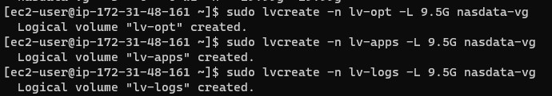
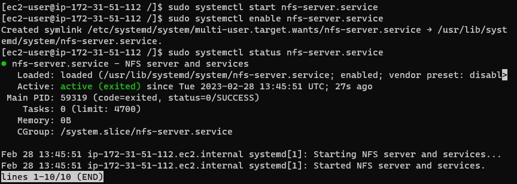
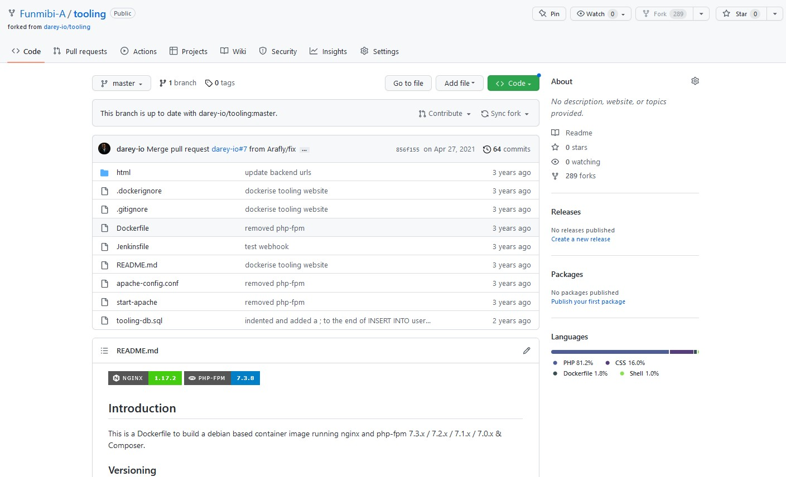

# Project 7 - Implementing DevOps Tooling Website Solution


## __NETWORK-ATTACHED STORAGE (NAS)__

    Network-attached storage (NAS) is a type of data storage device that provides local-area network (LAN) nodes with file-based shared storage through a standard Ethernet connection. It connects to a network and provides centralized storage that can be accessed by multiple devices on the network. This makes it an ideal solution for homes, small businesses, and organizations that need to store and share large amounts of data and multimedia content, such as videos, music, photos, and documents.
  
    NAS devices typically run a specialized operating system that provides file sharing, data protection, and other advanced features. Some popular features of NAS devices include the ability to create and manage user accounts, access control lists, backup and disaster recovery options, and the ability to run applications and services, such as media servers, web servers, and surveillance systems.

    NAS devices can be connected to the network via Ethernet, and may also have additional ports for external storage devices, such as USB or eSATA. Some higher-end NAS devices can also support iSCSI and Fibre Channel connectivity, making them suitable for use in more demanding enterprise environments.

## __STORAGE AREA NETWORK (SAN)__

    A Storage Area Network (SAN) is a high-speed network that provides block-level access to data storage. Unlike a Network-Attached Storage (NAS) system, which uses file-level protocols to access data, a SAN uses block-level protocols to access data storage.

    SANs are designed to provide a high-performance, highly-available, and scalable storage infrastructure that can support demanding business applications and services.

    SANs can be connected to servers via Fibre Channel or iSCSI protocols, which provide high-speed data transfer. Some SANs also support network-based protocols such as NFS and SMB for file-level access to storage.

## **NFS**

    NFS stands for Network File System, which is a protocol for accessing and sharing files over a network. 
    
    NFS enables a computer to access files on another computer as if they were local files. This allows for centralizing data storage and making it easier to manage and share files across multiple systems.

    NFS uses the client-server model, where a client computer sends a request to the server to access a file. The server then sends the file back to the client, where it is processed and stored. NFS uses a version 4 protocol that provides improved performance, security, and scalability compared to earlier versions of the protocol.

    NFS is commonly used for file sharing in enterprise environments, especially in UNIX and Linux environments. It is often used for data sharing between servers and for backup and disaster recovery purposes.


## **SFTP**

    SFTP stands for Secure File Transfer Protocol, which is a secure and reliable way to transfer files over a network. SFTP is based on the Secure Shell (SSH) protocol and is used for securely transferring files between two systems. Unlike the traditional FTP (File Transfer Protocol), which transfers files in an unencrypted format, SFTP encrypts both the data being transferred and the control information used to manage the transfer.

##  __SMB__

    SMB stands for Server Message Block, which is a protocol used for file sharing in Windows-based environments. SMB is used for accessing and sharing files, printers, and other resources on a network.

    SMB provides a number of features that make it a popular choice for file sharing in Windows-based environments, including:

    User authentication: SMB supports user authentication, which allows administrators to control access to resources based on user credentials.

    File and printer sharing: SMB provides the ability to share files and printers over a network, which makes it easy for multiple users to access and use shared resources.

    File locking: SMB supports file locking, which allows multiple users to access and modify a file simultaneously while preventing concurrent modifications.

    Data compression: SMB provides the ability to compress data during transfer, which can improve transfer speeds over slow networks.


## __ISCSI__

    iSCSI (Internet Small Computer System Interface) is a protocol that enables the transfer of SCSI commands over a TCP/IP network. iSCSI is used for accessing and managing storage devices, such as disk arrays and tape libraries, over a network. The protocol allows servers to access storage devices as if they were locally attached, which makes it easy to centralize storage and manage it from a single location.

    iSCSI provides several benefits over other storage access technologies, including:

    - Compatibility: iSCSI is compatible with a wide range of operating systems, storage devices, and network infrastructure, which makes it easy to integrate into existing environments.

    - Cost-effectiveness: iSCSI uses standard Ethernet networking technology, which is less expensive than specialized storage networking technologies, such as Fibre Channel.

    - Scalability: iSCSI supports multiple connections to the same storage device, which makes it possible to scale storage as needed and provide high availability.

##  What is Block-level storage?

    Block-level storage is a type of storage that is organized into blocks of fixed sizes, typically ranging from 512 bytes to several megabytes. In block-level storage, data is stored in individual blocks, which can be managed and accessed individually, rather than as a continuous stream of data. Each block has a unique address, which allows it to be accessed and modified directly, rather than having to read and write the entire file.

  > How block level storage is used by Cloud service providers.

    Block-level storage is used by cloud service providers to provide storage for virtual machines and other applications that require low-latency, high-performance access to data. For example, Amazon Web Services (AWS) provides block-level storage through its Elastic Block Store (EBS) service. EBS allows customers to create and attach virtual storage volumes to their EC2 instances, providing access to persistent storage for their applications.

> Difference between Block Storage and Object Storage and Network File System

    The main difference between block-level storage and object storage and NFS is the way data is organized and accessed.
    
    In object storage, data is organized into objects, which are typically larger than blocks and include both data and metadata. 

    Object storage is designed for scalability and durability, and is often used for storing large amounts of unstructured data, such as photos, videos, and other files.

    NFS is best for sharing files between instances over a network. 


> Difference between Block Storage and Object Storage and Network File System in the context of AWS

    In the context of AWS services, block storage is provided by EBS, while object storage is provided by Amazon Simple Storage Service (S3). Network File System (NFS) is another storage option available in AWS, and is used for sharing files between instances over a network. NFS is similar to block-level storage in that it is organized into files, but it is designed for use in file-based environments and provides file-level access, rather than block-level access.


# **LABs**


## Implementing a DevOps Tooling Website Solution

## Step 1 - Prepare the NFS Server

> Spin up a new EC2 instance with RHEL Linux 8 Operating System.

> Based on your LVM experience from Project 6, __Configure LVM on the Server.__

> Attach 3 volumes to the newly provisions NFS server, log into the server and make sure the volumes are attached properly
 

    lsblk


__Use gdisk utility to create a single partition on each of the 3 disks__

    sudo gdisk /dev/xvdf
    sudo gdisk /dev/xvdg
    sudo gdisk /dev/xvdh

__Verify the attached disks were formated properly__

    lsblk 


__install lvm2__

    sudo yum install lvm2


__Check for available partitions__

    sudo lvmdiskscan


__Use pvcreate utility to mark each of 3 disks as physical volumes (PVs) to be used by LVM__

    sudo pvcreate /dev/xvdf1
    sudo pvcreate /dev/xvdg1
    sudo pvcreate /dev/xvdh1


__Verify the physical volumes__

    sudo pvs
    


__Use vgcreate utility to add all 3 PVs to a volume group (VG). Name the VG webdata-vg__

    sudo vgcreate nasdata-vg /dev/xvdh1 /dev/xvdg1 /dev/xvdf1


__Verify logical group__

    sudo vgs


__Use lvcreate utility to create 2 logical volumes.__

    sudo lvcreate -n lv-opt -L 9.5G nasdata-vg
    sudo lvcreate -n lv-apps -L 9.5G nasdata-vg
    sudo lvcreate -n lv-logs -L 9.5G nasdata-vg



__Verify logical group__

    sudo lvs


> Format the disk as xfs

    sudo mkfs -t xfs /dev/nasdata-vg/lv-opt

    sudo mkfs -t xfs /dev/nasdata-vg/lv-apps

    sudo mkfs -t xfs /dev/nasdata-vg/lv-logs


> Create mount points on /mnt directory for the logical volumes as follows:

    Mount lv-apps on /mnt/apps – To be used by webservers

    Mount lv-logs on /mnt/logs – To be used by webserver logs

    Mount lv-opt on /mnt/opt – To be used by Jenkins server in Project 8   
---
    sudo mkdir /mnt/apps
    sudo mkdir /mnt/opt
    sudo mkdir /mnt/logs

    sudo mount /dev/nasdata-vg/lv-apps /mnt/apps
    sudo mount /dev/nasdata-vg/lv-opt /mnt/opt
    sudo mount /dev/nasdata-vg/lv-logs /mnt/logs


    sudo blkid 


> Edit /etc/fstab

    sudo vi /etc/fstab

    UUID=6f7429e0-b8f6-47a5-b702-6705b8f5c714 /mnt/logs xfs default 0 0
    UUID=585685a6-2a45-4e3f-ab33-b52a7f816dd3 /mnt/apps xfs default 0 0
    UUID=3a1298e2-553e-462e-9d8d-34b6e1e0667d /mnt/opt xfs default 0 0


> Install the NFS server, configure it to start on reboot and make sure it is up and running

    sudo yum -y update
    sudo yum install nfs-utils -y
    sudo systemctl start nfs-server.service
    sudo systemctl enable nfs-server.service
    sudo systemctl status nfs-server.service





> Export the mounts for webservers 'subnet cidr' to connect as clients.

__Note:__ To check your 'subnet cidr' - open your EC2 details in AWS web console and locate 'Networking' tab and open a Subnet lD

> Make sure we set up permission that will allow our Web servers to read, write and execute files on NFS.

    sudo chown -R nobody: /mnt/apps
    sudo chown -R nobody: /mnt/logs
    sudo chown -R nobody: /mnt/opt
---
    sudo chmod -R 777 /mnt/apps
    sudo chmod -R 777 /mnt/logs
    sudo chmod -R 777 /mnt/opt
---
    sudo systemctl restart nfs-server.service


> Configure access to NFS for clients within the same subnet

    sudo vi /etc/exports

    /mnt/apps 172.31.80.0/20
    (rw,sync,no_all_squash,no_root_squash)
    /mnt/logs 172.31.80.0/20
    (rw,sync,no_all_squash,no_root_squash)
    /mnt/opt 172.31.80.0/20
    (rw,sync,no_all_squash,no_root_squash)

    Save and exit.

> Export

    sudo exportfs -arv


> Find the port being used by NFS and create new inbound rules in the security group to allow traffic on that port.

    rpcinfo -p | grep nfs


Note: Open the following ports to allow the NFS server to be accessible from the clients
TCP port 111, 
UDP port 111,
TCP port 2049,
UDP port 2049


# Install and configure a MySQL DBMS to work with remote Web Server

> Install mysql server
  
Update repository

    sudo yum update

  __install MySQL repository by downloading and installing the appropriate RPM package frm MySQL website__

    sudo yum install wget
---
    sudo wget  https://dev.mysql.com/get/mysql80-community-release-el9-1.noarch.rpm 


  
    sudo rpm -ivh mysql80-community-release-el9-1.noarch.rpm


  __Install MySQL server package__

    sudo dnf install mysql-server


  __Start the MySQL service and set it to start automatically at boot time__

    sudo systemctl start mysqld
    sudo systemctl enable mysqld
    sudo systemctl status mysqld


  __Secure the MySQL installation by running the mysql_secure_installation script__

```
    sudo grep 'temporary password' /var/log/mysqld.log | awk '{print $NF}'

    sudo mysql -u root -p

```

> Configuring remote connections

  __Navigate to the MySQL server configuration file__

    cd /etc/my.cnf


  __Create a database and name it tooling__

    sudo mysql -u root -p

    ALTER USER 'root'@'localhost' IDENTIFIED BY 'your-new-password;


    ```SQL
     CREATE DATABASE tooling;
    ```

  __Create a database user and name it webaccess__

```SQL
    CREATE USER 'webaccess'@'172.31.80.0/20' IDENTIFIED BY 'root!';
```


```SQL
    GRANT ALL PRIVILEGES ON tooling.* TO 'webaccess'@'172.31.80.0/20' WITH GRANT OPTION;
```


```SQL
    FLUSH PRIVILEGES;
```

# Preparing the Web Servers

__Deploy 3 new redHat Servers and configure NFS client__

    sudo yum update
---
__Install mysql client for remote connection to database server server__

    sudo yum install mysql
   
__Install NFS client__

    sudo yum install nfs-utils nfs4-acl-tools -y


    sudo mkdir /var/www

    sudo mount -t nfs -o rw,nosuid 
    <private-ip-address-nfs-server>:/mnt/apps /var/www

__Verify NFS was mounted successfully on the new web server__


__Make sure the changes persist on Web server after reboot__

    navigate to ...

    sudo vi /etc/fstab

__add the following lines__

    <private-ip-address-nfs-server>:/mnt/apps /var/www nfs defaults 0 0

__Install Remi's repository, Apache and PHP__

    sudo yum install httpd -y
    
    sudo systemctl start httpd

    sudo systemctl status httpd
    
    sudo systemctl enable httpd


    sudo dnf install https://dl.fedoraproject.org/pub/epel/epel-release-latest-9.noarch.rpm


    sudo dnf install dnf-utils http://rpms.remirepo.net/enterprise/remi-release-9.rpm


    sudo dnf module reset php


    sudo dnf module enable php:remi-7.4


    sudo dnf install php php-opcache php-gd php-curl php-mysqlnd


__Start php__

    sudo systemctl start php-fpm

    sudo systemctl enable php-fpm


sets the httpd_execmem SELinux boolean to "on" persistently, which allows the Apache web server (httpd) to execute code from memory, which is good for web applications that use JIT (just-in-time) applications.

    sudo setsebool -P httpd_execmem 1

__Verify files sync on servers and NFS servers__


__Locate the log folder for apache web server and mount it to NFS server's export for logs__

    sudo mount -t nfs <nfs-servers-private-ip>:/mnt/logs /etc/httpd/logs


__make sure the mount point will persist after reboot__

    sudo vi /etc/fstab

    <nfs-servers-ip-address>:/mnt/logs /etc/httpd/logs nfs defaults 0 0
    

__Install GIT__

    sudo yum install git

__Fork the tooling source code from 'Darey.io' Github account to your Github account__
    
    git clone https://github.com/darey-io/tooling.git



__Deploy the tooling website's code to the Webserver__


__Ensure that the html folder from the repository is deployed to /var/www/html__

     cd tooling
     sudo cp -R . /var/www

__Update the website configuration to connect to the dataase in the "/var/www/html/functions.php" file Apply tooling-db.sql script to your database using the following command__

    sudo mysql -h <databse-private-ip> -u <db-username> -p <db-name> < tooling-db.sql


__Create in mysql a new admin user with username: myuser and password: password:__

```SQL
    use tooling;

    UPDATE `users`
    SET `username` = 'myuser',
        `password` = '575b',
        `email` = 'user@mail.com',
        `user_type` = 'admin',
        `status` = '1'
    WHERE `id` = 1;
```

__Open the website in your web browser__

<http:/<Web-Server-Public-IP-Address-or-Public-DNS-Name>/index.php>


    Note 1: Do not forget to open TCP port 80 on the Web Server.
---
    Note 2: If you encounter 403 Error – check permissions to your /var/www/html folder and also disable SELinux sudo setenforce 0
---
    To make this change permanent – open following config file sudo vi /etc/sysconfig/selinux and set SELINUX=disabled then restrt httpd.


